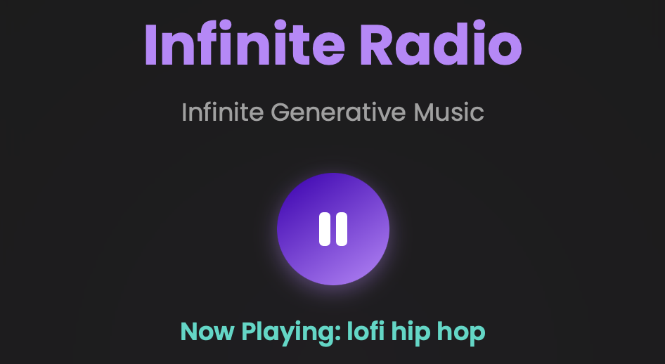

<div align="center">

[](https://www.apache.org/licenses/LICENSE-2.0)
[](https://github.com/LaurieWired/InfiniteRadio/releases)
[](https://github.com/LaurieWired/InfiniteRadio/stargazers)
[](https://github.com/LaurieWired/InfiniteRadio/network/members)
[](https://github.com/LaurieWired/InfiniteRadio/graphs/contributors)
[](https://twitter.com/lauriewired)



</div>

# Infinite Radio

Infinite Radio generates endless music that automatically changes based on your current context. It combines the [Magenta RealTime](https://magenta.withgoogle.com/magenta-realtime) music model with contextual genre selection either from [InternVL3](https://huggingface.co/OpenGVLab/InternVL3-2B) or the top processes running on your machine.

# Installation

## Prerequisites

For running the music model locally, you will need:
- **Docker** with GPU support
- **NVIDIA GPU** with CUDA support
- **[NVIDIA Container Toolkit](https://docs.nvidia.com/datacenter/cloud-native/container-toolkit/latest/install-guide.html)**

## Music Model

1. **Run the Docker Container from [Dockerhub](https://hub.docker.com/repository/docker/lauriewired/musicbeats/general):**
   ```bash
   docker run --gpus all --network host lauriewired/musicbeats:latest
   ```

2. **Access the web interface:**
   - Open your browser and navigate to `http://127.0.0.1:8080` or the IP where the music container is running
   - Click the play button to start streaming
  
## Running a DJ

## Option 1: Running the DJ on MacOS

1. **Download the latest release:**
   - Go to the releases page and download the [latest version](https://github.com/LaurieWired/InfiniteRadio/releases/download/v1.0/InfiniteRadio.zip)
   - Run the .app file and Infinite Radio will appear in your tray

2. **Configure to point to the IP and port of the music model**

3. **Select and run your DJ of choice**
   - You can run the process DJ immediately or choose the LLM DJ
   - If selecting the LLM DJ, ensure the model server is running already in [LM Studio](https://lmstudio.ai) (See Option 3 below for an example although running the python script is not required when using the Mac app)

## Option 2: Running Process DJ with Python

The Process DJ will monitor the processes on your system and automatically change music genres based on what applications are most active.

```bash
python process_dj.py 127.0.0.1 8080 # Point this to the IP and port of the music model
```

## Option 3: Running the LLM DJ with Python

The LLM DJ analyzes the data on your screen to automatically configure the genre that best suits your activity.

1. **Run the LLM in LM Studio:**
   - Download [InternVL3](https://huggingface.co/OpenGVLab/InternVL3-2B) (or any image to text model)
   - Start the server in LM Studio
  


2. **Run the Python Connection:**
   ```bash
   python llm_dj.py 127.0.0.1 8080 # Point this to the IP and port of the music model
   ```

# API Reference

## Change Genre

**POST** `/genre`

```bash
curl -X POST http://localhost:8080/genre \
  -H "Content-Type: application/json" \
  -d '{"genre": "jazz"}'
```

## Get Current Genre

**GET** `/current-genre`

```bash
curl http://localhost:8080/current-genre
```

# Building

Building the Mac application:

```
pip install py2app jaraco.text setuptools
python3 setup.py py2app
```
